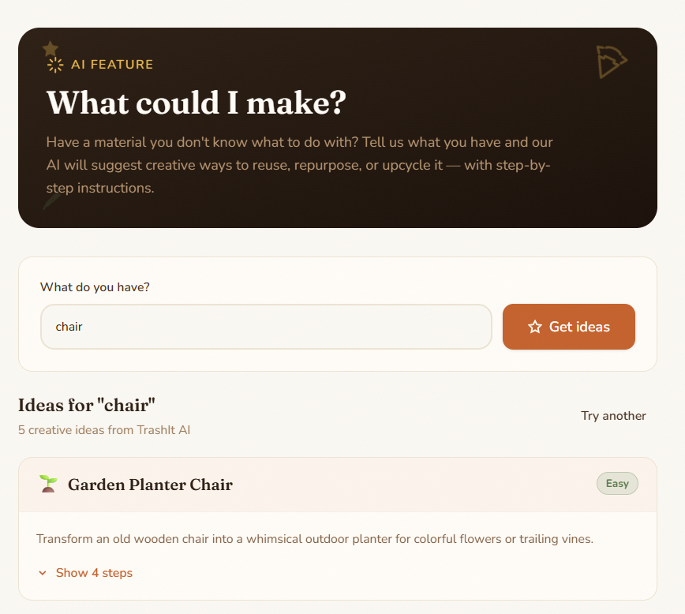

# TrashIt 

**TrashIt** is a community-driven marketplace for buying, selling, and repurposing materials � powered by AI. List what you have, find what you need, and let our AI match you with the right people or spark creative ways to upcycle your items.

> Built to reduce waste and connect communities through smarter resource sharing.

## Live Demo

**[trash-it-three.vercel.app](https://trash-it-three.vercel.app/)**

---

##  Tech Stack

<p align="left">
  
  
  
  
  
  
  
  
  
  
  
</p>

---

##  Screenshots

###  AI  "What Could I Make?"
> Tell the AI what material you have and it suggests creative ways to reuse, repurpose, or upcycle it � with step-by-step instructions.



---

###  AI Post Matches
> The AI scans BUY and SELL posts and automatically connects you with the most relevant listings.


---

###  Create a Post
> Easily list what you're selling or what you're looking for in a clean two-step flow.


---

###  Browse Posts
> Explore community listings with filters by type, status, price range, and sort order.


---

###  Live Messages
> Real-time chat powered by WebSockets � negotiate, ask questions, and close deals instantly.


---

###  Notifications
> Get instant alerts for AI matches and new messages � all in one place.


---

##  Features

-  **Buy & Sell Listings**  Post items you have or materials you need
-  **AI Upcycle Ideas**  Get creative reuse suggestions for any material
-  **AI Match Engine**  Automatically pairs compatible buy/sell posts
-  **Real-time Messaging**  Live chat via WebSockets between buyers and sellers
-  **Smart Notifications**  Instant alerts for matches and messages
-  **Image Uploads**  Powered by Cloudinary
-  **Auth & Security**  JWT authentication with rate limiting and helmet
-  **Admin Panel**  Manage posts, users, and platform content

##  Getting Started

### Frontend

```bash
cd web
npm install
npm run dev
```

### Backend

```bash
cd Backend
npm install
npm run dev
```

### Admin

```bash
cd Admin
npm install
npm run dev
```

> Copy `.env` files and fill in your `MONGODB_URI`, `JWT_SECRET`, `CLOUDINARY_*`, and frontend origin URLs.
